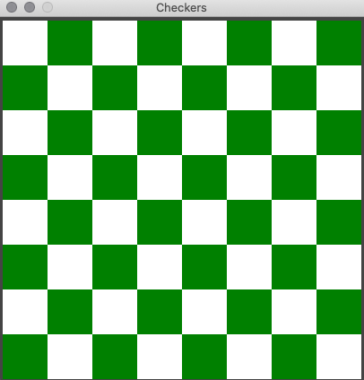

 
# Java: Programming in the Small

## About this Repository

This repo contains several programs that emphasize the basic building blocks of a Java program.
Listed, the programs are:

#### CheckerBoard
This program draws a CheckerBoard utilizing the JavaFX toolkit for GUI programming.

#### Compute Average
This program reads a sequence of positive integers input by the user, and it will print out the average of those integers.
#### Count Divisors
This program reads a positive integer from the user. It counts how many divisors that number has, and then it prints the result.
#### Length Converter
This program will convert measurements expressed in inches,
feet, yards, or miles into each of the possible units of
measure.
#### List Letters
This program lists all the letters contained in a string
and also counts the number of different letters.
#### List Words in a String
A program that reads one line of input text and breaks it up into its individual words.
The words are output one per line.
#### Most Divisors
This program finds an integer between 1 and 10000 that has
the largest number of divisors.
#### Moving Rectangles
#### 12 x 12 Multiplication Table
This program prints out a 12 by 12 multiplication table.
#### Print Square
A program that reads an integer typed in by the user and
computes and returns the square of that integer
#### Random Circles
#### Roll the Die
This program simulates rolling a pair of dice.
The number showing on each die is output as well as the total of the two dice rolls.
#### Sales Figures
Taking a file that contains information about sales figures for a company in various cities,
this program computes and prints the total sales from all the cities together.
It also reports the number of cities for which data was not available. We use the test file "sales.dat"
#### Simple Calculator
This program evaluates simple math expressions.
#### Simple Graphics Starter
#### Snake Eyes
This program simulates rolling a pair of dice until they
come up snake eyes.  It reports how many rolls were needed.
#### 3N + 1
This program reads in a positive integer from the user and
prints out the 3N+1 sequence starting from that integer.
